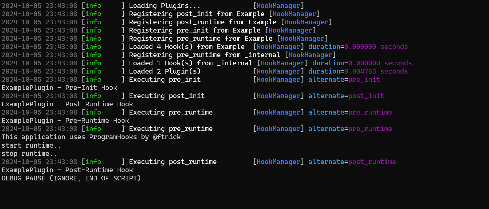

# ProgramHooks



**To download and install ProgramHooks, refer to [DOWNLOAD.md](DOWNLOAD.md).**

---

**ProgramHooks** is a flexible and dynamic framework for Python that enables you to define and manage lifecycle hooks in your applications. It provides a straightforward mechanism for pre-initialization, post-initialization, pre-runtime, and post-runtime hooks, facilitating modular code design and easy plugin integration.

*Note: I am an independent developer and new to Python. I appreciate any helpful comments or constructive criticism!*

---

## Overview

The core concept behind **ProgramHooks** is to create a centralized hook manager that can dynamically load and execute hooks from external Python scripts (plugins). This allows developers to extend the functionality of their applications without altering the core codebase.

### Features
- **Dynamic Hook Management**: Easily register and execute hooks at various stages of your program.
- **Plugin Architecture**: Load and manage external plugins that define specific hook functions.
- **Argument Support**: Pass arguments to hooks for enhanced functionality.
- **Modular Design**: Promote separation of concerns by defining hooks in different modules.

---

## How It Works

1. **Hook Manager**: The main component responsible for managing the lifecycle hooks.
2. **Plugins**: External Python scripts that implement hook functions to perform actions at specific stages.
3. **Dynamic Discovery**: The hook manager scans a designated folder for plugins, loads them, and registers their hook functions.

### Available Lifecycle Hooks
- **Pre-Init Hook**: Invoked before initialization.
- **Post-Init Hook**: Invoked after initialization.
- **Pre-Runtime Hook**: Invoked before the main runtime logic.
- **Post-Runtime Hook**: Invoked after the main runtime logic.

---

## Getting Started

1. **Create Plugins**: Write your plugins in the `plugins` folder. Each plugin should define functions matching the hook names:
    - `pre_init`
    - `post_init`
    - `pre_runtime`
    - `post_runtime`

2. **Run the Hook Manager**: Execute the `hook_manager.py` script to load the plugins and run the hooks:

    ```bash
    python hook_manager.py
    ```

3. **Example Plugin**: Here’s a simple example of a plugin:

    ```python
    # plugins/plugin_example.py
    def pre_init(init_data, **kwargs):
        print(f"Pre-Init: {init_data}, {kwargs}")

    def post_runtime(user_id=None):
        print(f"Post-Runtime User ID: {user_id}")
    ```

    **Example For MainScript**: The main script using the example plugin might look like this:

    ```python
    hook_manager.execute_hooks('pre_init', "Initialization Data", config={"setting": "value"})
    
    hook_manager.execute_hooks('post_runtime', timeplayed=21)
    ```

### Hook Arguments

Hooks can accept arguments, allowing customization of their behavior. For instance, you can pass configuration data or state information when invoking the hooks.

---

## Notices and Details

- Ensure that all plugins are correctly named and placed in the `plugins` directory for automatic loading.
- Hooks are executed in the order they are registered; name and organize your plugins mindfully if you rely on a specific order.
- Plugins should handle their errors gracefully; uncaught exceptions in a plugin will cause the hook manager to halt execution.

---

## Warnings

- **Compatibility**: This framework is designed for Python 3.x. Ensure your environment is set up correctly.
- **Performance**: Dynamic loading of plugins may introduce slight performance overhead. Use this feature judiciously, especially in performance-critical applications.
- **Security**: Be cautious when loading external scripts. Ensure that all plugins are from trusted sources to avoid executing malicious code.

---

## License

This project is licensed under the MIT License. See the [LICENSE](LICENSE) file for details.

---

## Acknowledgements

- Inspired by various plugin systems and hook frameworks in software development.
- Special thanks to the open-source community for their contributions.

---

For further assistance or inquiries, feel free to open a [discussion](https://github.com/ftnick/ProgramHooks/discussions).
